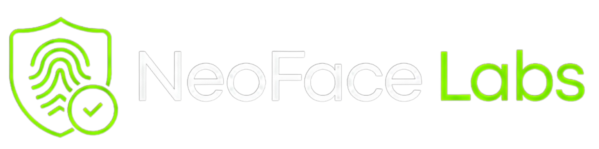

<div align="center">



# NeoFace

### Enterprise-Grade Biometric Identity & Payment Infrastructure

**The world's most advanced multi-modal biometric authentication platform.**  
Face · Iris · Fingerprint · Liveness · Deepfake Detection · Continuous Auth · Trust Engine

[](https://python.org)
[](https://fastapi.tiangolo.com)
[](https://nextjs.org)
[](https://typescriptlang.org)
[](https://firebase.google.com)
[](https://redis.io)
[](https://docker.com)
[](https://neoface.io)

---

[Overview](#-overview) · [Architecture](#-architecture) · [Features](#-features) · [Tech Stack](#-tech-stack) · [API Reference](#-api-reference) · [Quick Start](#-quick-start) · [Deployment](#-deployment)

</div>

---

## 🧠 Overview

NeoFace is a **production-ready, enterprise-grade biometric identity and payment platform** built for the post-password era. It combines cutting-edge computer vision, machine learning, and fraud prevention into a single unified infrastructure.

The system is designed to serve as the authentication backbone for:
- **Biometric payment authorization** (Face Pay, Iris Pay, Fingerprint Pay)
- **Identity verification** for KYC/AML compliance
- **Continuous authentication** for high-security enterprise sessions
- **Fraud prevention** with real-time deepfake and spoof detection
- **Multi-tenant B2B SaaS** deployments

> NeoFace processes biometric identity in **<150ms** and supports **1,000+ concurrent users** out of the box.

---

## 🏗 Architecture

```
neoface/
│
├── frontend/                          # Next.js 16 + React 19 (TypeScript) -> Deployed on Vercel
│   ├── app/                           # App Router pages
│   │   ├── page.tsx                   # Landing page (3D animated hero)
│   │   ├── login/                     # JWT + Firebase OAuth login
│   │   ├── register/                  # User registration
│   │   ├── enroll/                    # Biometric enrollment wizard
│   │   ├── verify/                    # Face verification flow
│   │   ├── checkout-demo/             # Live biometric payment demo
│   │   └── dashboard/                 # Admin control center
│   ├── components/
│   │   ├── core/                      # FirebaseAuthProvider, SmoothScroll, NoiseOverlay
│   │   ├── ui/                        # Button, Card, Badge, Input (Radix + CVA)
│   │   └── visuals/                   # 3D BiometricOrbit, FaceMeshCanvas, IdentityCore
│   └── lib/
│       ├── api.ts                     # Axios client (JWT interceptors)
│       └── firebase.ts                # Firebase SDK initialization
│
└── backend/                           # FastAPI + Python 3.12 -> Deployed on Render
    ├── app/
    │   ├── api/v1/                    # REST API endpoints (18 modules)
    │   │   ├── auth.py                # Login, register, refresh, Google OAuth
    │   │   ├── enrollment.py          # Multi-image face enrollment
    │   │   ├── verification.py        # 1:N face verification
    │   │   ├── biometrics.py          # Iris & fingerprint enrollment/verify
    │   │   ├── payments.py            # Biometric payment authorization
    │   │   ├── webauthn.py            # FIDO2/WebAuthn device fingerprint
    │   │   ├── dashboard.py           # Analytics & reporting
    │   │   └── security.py            # Security & IP blocklists
    │   ├── core/
    │   │   ├── config.py              # Pydantic Settings (env vars)
    │   │   └── database.py            # Firebase Firestore client setup
    │   ├── models/                    # Model wrappers for entity structures
    │   ├── services/                  # Business logic & ML inference
    │   │   ├── anti_spoof_service.py  # MiniFASNet ONNX anti-spoofing
    │   │   ├── active_liveness_service.py # Challenge-response checks
    │   │   ├── passive_liveness_service.py # Passive spoof detection
    │   │   └── risk_scoring_service.py # NeoFace Trust Score engine
    │   ├── repositories/              # Async Firestore repositories
    │   ├── tasks/                     # Celery background workers
    │   └── main.py                    # FastAPI app factory + lifespan
    ├── Dockerfile                     # Multi-stage Python 3.12 build
    └── requirements.txt               # Pinned dependencies
```

---

## 🛠 Tech Stack

* **Frontend**: Next.js 16 + React 19 (TypeScript) with TailwindCSS. Hosted on **Vercel**.
* **Backend**: FastAPI (Python 3.12) and Celery workers. Hosted on **Render**.
* **Database & Auth**: Firebase Firestore (NoSQL) and Firebase Authentication (Google OAuth).
* **Storage**: Cloudflare R2 / AWS S3 (private biometrics bucket).
* **Broker & Cache**: Redis 7.2.

---

## ✨ Features

### 🔐 Core Biometric Engine

| Feature | Details |
|---|---|
| **Face Recognition** | InsightFace `buffalo_l` · ArcFace 512-d embeddings · Cosine similarity 1:N search · <150ms |
| **Multi-image Enrollment** | 1–5 images per user · Quality validation · Blur detection · Embedding averaging |
| **Face Verification** | 7-step pipeline: detect → liveness → embed → 1:N search → user validate → log |
| **Iris Recognition** | Daugman rubber sheet normalization · 2D Gabor IrisCode · Masked Hamming Distance |
| **Fingerprint Recognition** | ISO/IEC 19794-2 minutiae extraction · CLAHE enhancement · MCC-style matching |
| **Biometric Fusion** | Score-level fusion: Face 45% + Iris 35% + Fingerprint 20% · Auto-renormalization |

---

## 🚀 Quick Start

For detailed setup instructions, please read [SETUP.md](file:///Users/divyebhatnagar/Desktop/NeoFace/SETUP.md).

### 1. Configure Envs
```bash
cp backend/.env.example backend/.env
cp frontend/.env.example frontend/.env.local
```

### 2. Download Models
```bash
cd backend
python3 scripts/download_models.py --all
cd ..
```

### 3. Deploy Rules & Indexes
```bash
firebase deploy --only firestore --project <your-project-id>
```

### 4. Start Local Environment
```bash
# On macOS/Linux:
./start.sh

# On Windows:
PowerShell -ExecutionPolicy Bypass -File .\start.ps1
```
</div>
